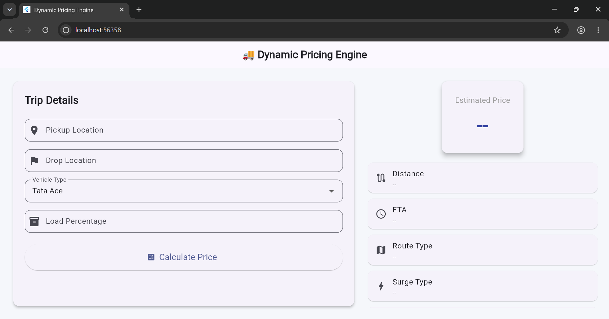

# Dynamic Pricing Engine for Logistics

A full-stack logistics pricing simulator built using Flutter and FastAPI.

## Features

- Real route distance calculation
- ETA estimation
- Dynamic pricing engine
- Vehicle-specific pricing
- Load-based pricing adjustments
- Route-type classification
- Time-based surge pricing
- Pricing breakdown visualization
- Responsive Flutter Web dashboard

## Tech Stack

### Frontend
- Flutter Web
- Dart

### Backend
- FastAPI
- Python

### APIs
- OpenRouteService
- OpenStreetMap Nominatim

## Pricing Factors

The pricing engine considers:

- Vehicle type
- Distance
- Load percentage
- Route type
- Surge period
- Pickup charges

## Screenshots

### Dashboard

### Pricing Result

## Project Structure

dynamic-pricing-engine/

├── backend/

│ ├── main.py

│ ├── pricing.py

│ └── requirements.txt

├── frontend/

│ └── Flutter Web App

└── Screenshots/

## Future Improvements

- Live map visualization
- Traffic-aware pricing
- Demand forecasting
- Historical trip analytics
- Multi-vehicle comparison

## Author

Anshit Sharma